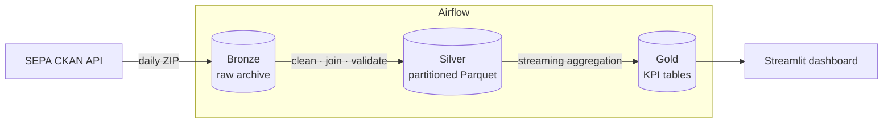

# 🇦🇷 Argentina Price Monitor — SEPA Data Engineering Pipeline


A fully containerized **end-to-end data pipeline** that ingests, validates and analyses
Argentina's official *Precios Claros / SEPA* retail price data.

> Government price data is published as a 300 MB bundle of nested ZIPs, one per retailer,
> with inconsistent encodings and no historical archive. This pipeline turns it into a
> queryable Parquet lakehouse and a price-trend dashboard.

---

## Architecture

Medallion (Bronze → Silver → Gold) on a MinIO S3-compatible data lake.



| Layer | Contents | Format |
| :--- | :--- | :--- |
| **Bronze** | The publisher's ZIP, byte-for-byte | `bronze/<tipo>/fecha=YYYY-MM-DD/*.zip` |
| **Silver** | Cleaned, enriched, schema-validated facts | `silver/<tipo>/precios/fecha=YYYY-MM-DD/<retailer>.parquet` |
| **Gold** | Daily KPI tables | `gold/<tipo>/*.parquet` |

---

## How the source actually works (and why it constrains the design)

`datos.produccion.gob.ar` does **not** publish one resource per date. It publishes exactly
**seven ZIPs named after the days of the week** (`sepa_lunes.zip` … `sepa_domingo.zip`),
each overwritten in place with that weekday's latest snapshot.

Two consequences drive the implementation:

1. To fetch date `D` you resolve the weekday slot for `D` and then **verify** it really
   holds `D` — via the resource's `last_modified` *and* the date-named folder inside the
   archive. Without that check you silently ingest week-old data under today's partition.
2. **Only the last 7 days are retrievable.** Backfilling further back is impossible from
   this endpoint; historical data has to come from your own Bronze archive. The CLI fails
   fast with an explicit message rather than producing empty partitions.

---

## Quick start

### Prerequisites
Docker and Docker Compose.

```bash
cp .env.example .env      # optional; sensible defaults are built in
docker compose up --build -d
```

| Service | URL | Credentials |
| :--- | :--- | :--- |
| Airflow UI | http://localhost:8080 | `admin` / `admin` |
| MinIO Console | http://localhost:9001 | `minioadmin` / `minioadmin` |
| Streamlit dashboard | http://localhost:8501 | — |

That is all. **The `sepa_pipeline` DAG starts unpaused and runs itself daily at
06:00 UTC**, so the lake fills without anyone touching the UI. Watch the
`sepa-datalake` bucket populate, or hit *Trigger DAG* if you don't want to wait.

### Why the daily run is self-healing

The portal keeps a rolling 7-day window and nothing older, so a failed run is on
a deadline: miss a date for a week and it is gone for good. Trusting one daily
task to always succeed is not enough, so every run ends by comparing what the
portal currently publishes against the Silver partitions on hand and ingesting
the difference:

```
fetch_bronze → transform_silver → catch_up → generate_gold
                                   ↑ all_done       ↑ all_done
```

`catch_up` and `generate_gold` run under `all_done`, so a failed fetch does not
skip the recovery path — the one case where recovery matters most. Concretely
this survives the archive not being published yet, a network blip, and the
machine being off overnight; and on a fresh lake the first run pulls the entire
available window instead of only yesterday.

`SEPA_BACKFILL_MAX_DAYS` bounds the look-back (default 7, the portal's own
retention). Set it to `1` for a strict "yesterday only" job with no self-healing.

### Running it without Airflow

The day's work sits behind one scheduler-agnostic entrypoint — it imports no
Airflow, so a cron, a systemd timer or a CI schedule can drive it just as well:

```bash
python -m src.daily --prune          # catch up + rebuild Gold + prune Bronze
```

`--prune` drops Bronze archives past `SEPA_BRONZE_KEEP_DAYS` (default 7). Bronze
is ~300 MB per day per dataset type, so it is what fills a small storage quota;
Silver is never pruned, being the derived history the dashboard reads.

**Free hosting:** GitHub Actions as the scheduler, Cloudflare R2 as the lake and
Streamlit Community Cloud for the dashboard — USD 0, no server.
See **[DEPLOY.md](DEPLOY.md)**, which also spells out why Render's free tier
cannot host this stack.

> **Smoke test tip:** a full day is ~300 MB compressed and tens of millions of rows.
> Set `SEPA_MAX_COMERCIOS=4` in `.env` to process only the first few retailer archives —
> the whole pipeline then completes in a couple of minutes.

### Loading data from the CLI

```bash
docker compose run --rm streamlit python -m src.fetch_sepa_range \
  --start-date 2026-07-20 --end-date 2026-07-21 --type minorista
```

Individual stages:

```bash
python -m src.fetch_sepa_prices --date 2026-07-21 --type minorista   # Bronze
python -m src.transform_sepa   --date 2026-07-21 --type minorista    # Silver
python -m src.generate_gold    --type minorista                      # Gold
```

---

## Gold tables

| Table | Grain | Notes |
| :--- | :--- | :--- |
| `daily_product_prices` | date × product | avg / min / max / sample count |
| `store_stats` | date × store | average basket level, products reported |
| `province_product_prices` | date × province × product | powers the geographic comparisons |
| `daily_inflation_index` | date | see below |

`daily_inflation_index` carries two series:

* **`indice_precio_global`** — the plain average of all listed prices. Easy to compute but
  it moves whenever the *mix* of reported products changes, so it is a weak inflation proxy.
* **`indice_matched_base100`** — a chained index built from the **trimmed-mean price
  relative of products present on both consecutive days**. Because it only compares like
  with like, a retailer starting to report expensive new items does not register as
  inflation. This is the series the dashboard leads with.

  It used the *median* first, which looked like the safe robust choice and turned out to be
  degenerate: on daily retail data most products hold their price, so as long as increases
  and decreases each stay under 50% the median lands inside the unchanged block and returns
  exactly 1.0. On the live feed it read **0.00% on all seven days — including one where 74%
  of products were repriced**. Trimming 5% off each tail keeps the robustness the median was
  chosen for (a mis-keyed price 100× off cannot drag the index) without the blind spot; it
  is the same construction central banks publish for core inflation. The median survives as
  `variacion_mediana_pct` for reference, and a test pins the degeneracy so it cannot come
  back.

---

## The dashboard

**The interface is in Spanish** — the monitor's audience is Argentine. That
means real localisation, not just translated strings: `$12.149` (period groups
thousands), `+2,39%` (decimal comma) and `21 jul 2026` are all formatted by hand,
because `locale.setlocale` needs the locale generated inside the image and is
process-global — it would silently reformat the ETL's logs too. Code, comments
and this README stay in English.

Five tabs over a single filter surface (data source, date range, province) that
scopes all of them.

**Overview** — the two index series, daily change as a diverging bar around zero,
and repricing activity.

**Basket** ⭐ — build the basket you actually buy, from scratch or from a preset,
edit quantities inline, and track its total cost over time. Then see **what the
same basket costs in every province**. On the live feed a 10-item staple basket
came out at $36 989 in San Juan versus $42 346 in Salta across the 9 provinces
with complete coverage — a 12.7% gap for the same goods.

Two correctness details that make the number trustworthy: only days where
*every* item is present are plotted (a basket whose membership drifts shows
phantom inflation), and only provinces reporting the *complete* basket are
ranked (otherwise the province with the least data always looks cheapest).

**Products** — search with brand filter; a **savings finder** ranking the widest
store-to-store spread per barcode (top result on the live feed: a cola at $1 685
versus $4 900 across 972 stores, a 66% saving); and biggest movers in both
directions.

The savings finder discards spreads wider than 3× — beyond that it is the same
barcode reported in different units (per unit vs per dozen), not a real saving.
Without that cap the ranking filled up with bakery items claiming "99% off".

**Stores & provinces** — cheapest stores, retail chains, and provincial averages.

**Pipeline health** — coverage calendar with gap detection, rows kept vs dropped,
and the effective configuration.

Every chart ships a table-view twin with CSV export.

### Design system

Everything visual lives in `src/theme.py`; `dashboard.py` composes and never
spells out a colour, radius or shadow of its own.

**Celeste, blanco y amarillo** — the flag, but stepped. White cards on a faint
celeste plane (`#eef3f9`), hairline borders and two tightly-spread shadow layers
(large diffuse blurs read as floating clip-art).

The literal flag colours cannot carry data: sun yellow `#f6b40e` sits at
lightness 0.81, outside the 0.43–0.77 band, and flag celeste `#74acdf` has
chroma 0.095 — it reads grey. They are kept for brand chrome (the monogram
gradient, washes) where nothing depends on telling them apart, while the series
use validated steps of the same hues. Type is the system sans on a tight
scale: uppercase micro-labels, `-0.028em` tracking on display figures,
proportional figures on values and tabular only inside table columns.

The page leads with a **hero panel**, not a row of equal tiles: four tiles of
the same weight give a reader no entry point, so nothing reads as the answer.
The matched index sits at display size (3.7rem) over its own full-bleed area
chart, with the supporting figures stacked as a ledger behind a rule on the
right. It is one composed HTML grid rather than Streamlit columns, which cannot
express a layout with a divider down the middle. A three-band celeste/white/
amarillo stripe caps it — the one place the literal flag colours appear, purely
decorative, encoding nothing.

**Each chart names itself** from inside its own card — a title floating above an
anonymous box makes the box read as filler, while a card with its own header
rule, accent dot and date range reads as a finished component. Heights are
deliberately tight: a tall card around a small plot is what made the first pass
look like a template.

Elsewhere, stat tiles carry a gradient accent rail, a coloured dot in the label,
a tinted delta pill on a fixed-height line and a full-bleed sparkline. Tabs are a
segmented control; the page closes on a provenance footer.

One trap worth recording: **`letter-spacing` inherits as a computed pixel
value**, so the hero figure's `-0.045em` (−2.7 px at 59 px) landed unchanged on
the 12 px label beside it and overlapped its glyphs. Every small child of a
display-size element resets tracking explicitly, and a test asserts it.

**Motion.** Streamlit strips `<script>` from injected HTML, so every animation
is CSS: tiles and cards rise-and-fade in on a staggered delay, sparklines draw
themselves via `stroke-dashoffset` (the polyline declares `pathLength="1"` so
one pair of dash values fits any path), status chips get a single sheen sweep,
and cards lift on hover. Each animation is written so the **resting state is the
finished one** — a paused timeline or `prefers-reduced-motion` yields the
finished UI, never a half-drawn one. Reduced motion is honoured explicitly.

Charts follow one system:

- The categorical palette is **validated, not eyeballed** — run through a
  colour-vision-deficiency validator against this app's own surface (`#ffffff`):

  | Slot | Hex | Role |
  | :--- | :--- | :--- |
  | 1 | `#1b7fc4` | celeste |
  | 2 | `#d99a00` | amarillo |
  | 3 | `#b5427f` | magenta |
  | 4 | `#7b4fc9` | violeta |

  Four slots on the adjacent pairlist: worst CVD ΔE 12.6, worst normal-vision
  ΔE 15.9. First three all-pairs: worst CVD ΔE 12.1, normal-vision ΔE 23.9.
  Amarillo carries a contrast WARN at 2.45:1, which is why every chart ships
  direct labels and a table view.
- **Capped at four on purpose.** Green and red cannot sit adjacent (ΔE 4.8 under
  deuteranopia — the classic confusion) and green/magenta lands in the 6–8 warn
  band, so the tail folds into "Other" instead of the palette growing hues.
- **One axis per plot.** No dual-axis charts.
- **One hue for nominal categories** — a value ramp across store names would
  double-encode bar length as colour. Where a single item is the point (the
  cheapest province), it gets the accent and the rest go grey.
- Price **up is never green**; direction is carried by an arrow and a word, not
  by colour alone.
- Solid hairline gridlines, thin marks, a 2px surface gap between fills.
- Bar labels sit outside the mark with `cliponaxis` off and a padded axis, so
  the longest bar never loses its value; date axes are forced to whole-day ticks
  (Plotly otherwise falls back to an hourly scale on a short daily series).

---

## Data quality

Pandera enforces a contract on every Silver chunk: non-null product/store identifiers and
prices inside a configurable band (`SEPA_MIN_PRICE` … `SEPA_MAX_PRICE`). Violations fail the
task by default; pass `--allow-validation-errors` to override.

Each transform run also writes a report to
`silver/<tipo>/_quality/fecha=<date>/report.json` (rows read, written, dropped, validation
failures, retailer counts). The dashboard's **Pipeline Health** tab reads these — the
quality score shown is measured, not hardcoded.

---

## Testing

```bash
pip install -r requirements-dev.txt
pytest
```

172 tests run offline. The pipeline tests use synthetic archives that reproduce the real
feed's quirks (UTF-8 BOM, pipe separators, footer lines, zero-byte and corrupt member
archives, and the differing minorista/mayorista column layouts). The dashboard's query
layer, chart chrome and UI components are tested without Streamlit or S3 (a fake `st` captures the rendered markup).

### Verified against live data

The refactor was validated end to end on the real portal, not just in unit tests:

* **Ingestion** — three dates fetched for `minorista` and two for `mayorista`, resolved via
  the CKAN API and confirmed against the date folder inside each archive.
* **Silver** — 13.1 M rows written for `minorista` and 563 K for `mayorista`, at
  **100% completeness and 0 validation failures** (partial runs using
  `SEPA_MAX_COMERCIOS`; a full day is ~30 M rows).
* **Gold** — all three tables built by streaming aggregation over the Silver partitions.
* **Airflow** — `fetch_bronze`, `transform_silver` and `generate_gold` each executed to
  success inside the Airflow image, and the DAG's data-interval arithmetic was checked
  against the timetable (a run firing `D+1 06:00` processes `D`).
* **Dashboard** — renders all KPIs, charts and tables against the live Gold layer with
  zero Streamlit exceptions.

The matched index earned its keep immediately: across two days the naive average moved
**+2.39%** while the matched index moved **0.00%** on 22,433 comparable products — the
entire apparent "inflation" was a change in which products got reported.

---

## Notable bugs fixed in the refactor

The pipeline previously ran to "success" while producing no usable data. The main causes:

| # | Bug | Effect |
| :--- | :--- | :--- |
| 1 | `config.CHUNK_SIZE` was referenced but never defined | `AttributeError` — the Silver stage never ran |
| 2 | Bronze flattened every retailer's CSVs into one prefix, and all retailers use the same three filenames | Each upload overwrote the last; ~99% of each day's data was destroyed |
| 3 | CSVs are UTF-8 **with BOM**, read as `utf-8` | A BOM stayed glued to the first header, so `id_comercio` never mapped and every join key went missing |
| 4 | Category filter matched keywords like `"alimentos"` against *product descriptions* | The feed has no `rubro` column and descriptions are brand strings — the filter discarded ~100% of rows. Now opt-in |
| 5 | `productos_ean` (a 0/1 flag) was mapped onto `id_producto` | Would have overwritten every product id with `0`/`1` |
| 6 | Resource discovery searched the HTML page for a date string | The page shows weekday names, not dates — discovery matched unrelated links. Replaced with the CKAN API |
| 7 | Two raw columns could map to one canonical name | Duplicate DataFrame labels, breaking downstream indexing and merges |
| 8 | Schema violations were logged, then the data written anyway | Validation was decorative; it is now a gate |
| 9 | Gold loaded the entire Silver history into one DataFrame | Out of memory on real volumes; now streams Arrow batches with foldable partial aggregates |
| 10 | `generate_gold` called `sys.exit(1)` inside library code | Killed the Airflow worker instead of failing the task |
| 11 | Dashboard indexed `.values[0]` on possibly-empty frames and assumed yesterday's partition existed | `IndexError` on any gap in the data |
| 12 | MinIO healthcheck used `curl`, absent from the image; `mc mb` failed on restart; Streamlit had no `--server.headless` | The stack could not come up cleanly twice in a row |

---

## Project structure

```
├── dags/sepa_pipeline.py       # Airflow DAG (one TaskGroup per dataset type)
├── src/
│   ├── config.py               # Env-driven configuration
│   ├── logging_utils.py        # Idempotent logging setup
│   ├── storage.py              # S3/MinIO helpers
│   ├── sepa_source.py          # CKAN resource discovery
│   ├── fetch_sepa_prices.py    # Bronze
│   ├── transform_sepa.py       # Silver
│   ├── generate_gold.py        # Gold
│   ├── fetch_sepa_range.py     # Backfill CLI + self-healing catch-up
│   ├── daily.py                # Scheduler-agnostic daily entrypoint
│   ├── data_access.py          # Dashboard queries (no Streamlit import)
│   ├── theme.py                # Design tokens + Plotly template
│   └── dashboard.py            # Streamlit app (presentation only)
├── .streamlit/config.toml      # Pinned light theme
├── .github/workflows/daily.yml # Free-tier scheduler (GitHub Actions cron)
├── tests/                      # Offline pytest suite
├── docker-compose.yml
├── Dockerfile                  # Dashboard / CLI image
└── Dockerfile.airflow          # Airflow image
```

---

## Author

**Hugo Astorga Ojeda** — Data Engineer
[LinkedIn](https://www.linkedin.com/in/hugo-astorga-ojeda/) · [GitHub](https://github.com/hugo9917)
