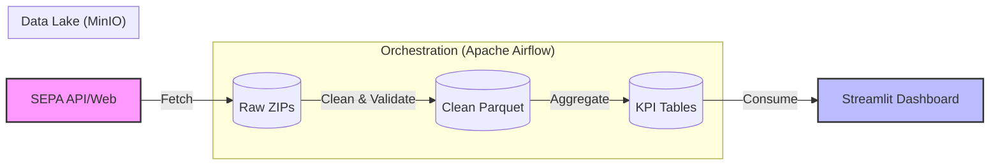

# 🇦🇷 Argentina Inflation Monitor: SEPA Data Engineering Pipeline


A professional, fully containerized **End-to-End Data Engineering Pipeline** designed to ingest, process, and analyze daily food price data from Argentina's "Precios Claros / SEPA" government datasets.

> **Problem Solved:** Government price data is often fragmented, difficult to access historically, and contains quality errors. This pipeline automates the ingestion, validates data integrity, and provides a real-time inflation dashboard for analytical insights.

---

##  Architecture

The project implements a **Lakehouse Architecture** using MinIO (S3 compatible) with a Medallion design pattern (Bronze $\to$ Silver $\to$ Gold).



1. **Ingestion (Bronze)**: `fetch_sepa_prices.py` handles reliable extraction (retries, timeouts), handles nested ZIP files, and uploads raw data to S3.
2. **Transformation (Silver)**: `transform_sepa.py` performs data cleaning, standardization, and strictly validates schemas using Pandera (failing on critical errors like negative prices).
3. **Analytics (Gold)**: `generate_gold.py` creates optimized "Star Schema" style aggregates (daily inflation index, product ranking) for reporting.
4. **Visualization**: A Streamlit app consumes the Gold layer to show inflation trends and store comparisons.

---

## Quick Start

Get the entire stack running in under 2 minutes.

### Prerequisites
- Docker & Docker Compose installed.

### Steps

1. **Clone the repository**:
   ```bash
   git clone https://github.com/hugo9917/sepa-pipeline.git
   cd sepa-pipeline
   ```

2. **Build and Start Services**:
   ```bash
   docker-compose up --build -d
   ```

3. **Access the Interfaces**:

| Service | URL | Credentials |
| :--- | :--- | :--- |
| **Airflow UI** | http://localhost:8080 | `admin` / `admin` |
| **MinIO Console** | http://localhost:9001 | `minioadmin` / `minioadmin` |
| **Streamlit App** | http://localhost:8501 | N/A |

4. **Run the Pipeline**:
   - Go to Airflow and trigger the `sepa_pipeline` DAG.
   - Watch the tasks populate the MinIO buckets (`bronze`, `silver`, `gold`).

---

## Key Technical Features

- **Dockerized Ecosystem**: Airflow, Postgres, MinIO, and Streamlit orchestrated via `docker-compose` for a reproducible environment.
- **Robust Error Handling**: Automatic retries and specialized logic for handling potentially corrupted or nested ZIP files from the source.
- **Data Quality Gates**: The pipeline uses **Pandera** to enforce schema contracts.
    - **Critical errors** (e.g., missing IDs, negative prices) stop the pipeline.
    - **Warnings** (e.g., statistical outliers) are logged for review.
- **Backfilling Capability**: Includes a dedicated CLI tool for historical data loading/recovery:
   ```bash
   # Recover data for a specific date range manually
   python -m src.fetch_sepa_range --start-date 2025-11-01 --end-date 2025-11-30 --type minorista
   ```

---

## Project Structure

```plaintext
sepa-pipeline/
├── dags/
│   └── sepa_pipeline.py          # Airflow DAG (Orchestration logic)
├── src/
│   ├── config.py                 # Central configuration
│   ├── fetch_sepa_prices.py      # Daily ingestion script
│   ├── fetch_sepa_range.py       # Backfilling/Historical script
│   ├── transform_sepa.py         # Cleaning & Pandera Validation
│   ├── generate_gold.py          # Aggregation logic
│   └── dashboard.py              # Streamlit Application
├── data/                         # Local volume mapped to MinIO (Persistence)
├── docker-compose.yml            # Infrastructure as Code
├── Dockerfile                    # Custom Python environment
└── requirements.txt              # Dependencies (pandas, airflow, s3fs, etc.)
```

---

## Author

**Hugo Astorga Ojeda**
- **Role**: Data Engineer
- **LinkedIn**: [hugo-astorga-ojeda](https://www.linkedin.com/in/hugo-astorga-ojeda/)
- **GitHub**: [hugo9917](https://github.com/hugo9917)
